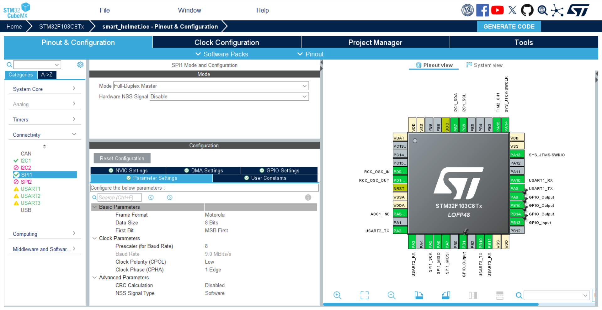
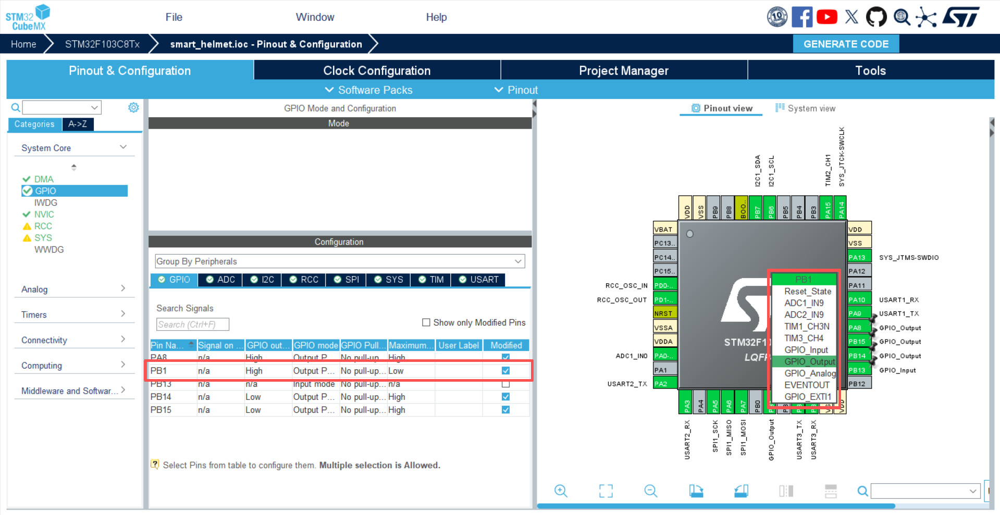
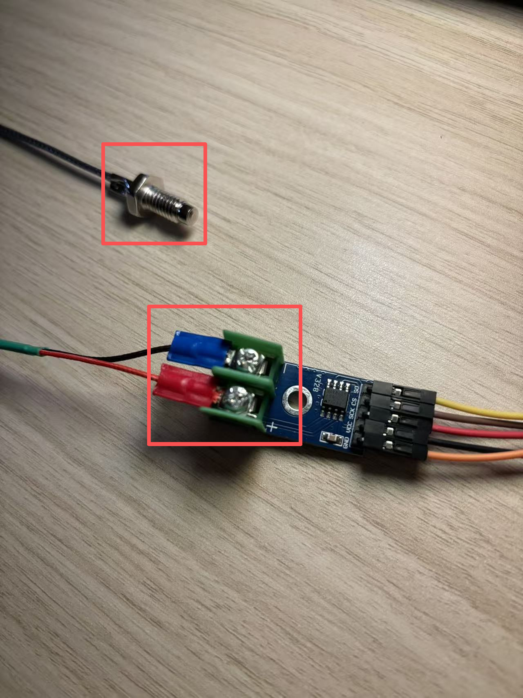

# 基于 STM32F103C8T6 的 HAL 库驱动 MAX6675 模块

<span style="font-weight:bold;">前言：</span>最近在项目开发中，我需要通过 MAX6675 模块获取温度。但查阅资料时发现，目前基于 HAL 库的开发资料很少，大多是标准库实现。由于我的代码框架已经采用 HAL 库搭建，为这一个模块切换到标准库会非常繁琐。因此，我通过查阅各大技术网站并结合 AI 咨询，最终完成了基于 STM32F103C8T6 的 HAL 库驱动 MAX6675 模块的实现，特此记录分享。

<span style="font-weight:bold;">声明：</span>本条博客不会过多讲解 MAX6675 模块的原理，相关内容在网上已有大量资料和博客可供参考。本文的核心重点，将放在该模块的实际使用方法讲解上。


## STM32CubeMX 的配置步骤

MAX6675 模块需通过 SPI 协议与 MCU 通信，因此我们首先要在 CubeMX 中完成 SPI 部分的配置。

我这里选用的是 SPI1，相关配置图如下：



MAX6675 模块的 CS 引脚需连接至 STM32 的 GPIO 引脚以实现片选控制，这里我将 PB1 配置为该模块的片选引脚。

相关配置图如下：



## STM32F103C8T6 与 MAX6675 模块的接线方式

### MAX6675 模块与热电偶的接线



从上图可以看出，热电偶的两个引脚需连接至 MAX6675 模块，通常红色线接 “+”，蓝色或黑色线接 “-”；而热电偶的另一端用于接触被测物体以获取温度。

### STM32F103C8T6 与 MAX6675模块的接线

```
                ┌───────────────┐
                │  MAX6675模块  │
                │               │
    3.3V/5V ────┤ VCC           │
       GND  ────┤ GND           │
STM32 PA5  ────┤ SCK           │
STM32 PB1  ────┤ CS            │
STM32 PA6  ────┤ SO            │
                │               │
                └───────────────┘
                      │
                      │ （模块自带热电偶接口，需额外接热电偶）
                      ▼
                热电偶（红“+”/蓝黑“-”）
```

## MAX6675 模块的驱动实现代码

```c
/* max6675.c */

#include "max6675.h"

// 布尔值定义
#define TRUE  1
#define FALSE 0

// 声明温度传感器结构体
ThermoCouple thermo = {&hspi1, GPIOB, GPIO_PIN_1, 0, 0.0f, false};

// SPI接收1字节
static uint8_t SPI_RxByte(SPI_HandleTypeDef *hspi)
{
  uint8_t dummy = 0xFF, data = 0;
  while (HAL_SPI_GetState(hspi) != HAL_SPI_STATE_READY);  // 等待SPI就绪
  HAL_SPI_TransmitReceive(hspi, &dummy, &data, 1, SPI_TIMEOUT);  // 收发1字节
  return data;
}

// 读取MAX6675数据并更新到结构体
void ReadThermoCouple(ThermoCouple *Th)
{
	unsigned short data;

	HAL_GPIO_WritePin(Th->Thx_CS_Port, Th->Thx_CS_Pin, GPIO_PIN_RESET);  // 拉低片选，开始通信
	
	// 读取16位原始数据
	data = SPI_RxByte(Th->hspi) << 8;
	data |= SPI_RxByte(Th->hspi);
	
	HAL_GPIO_WritePin(Th->Thx_CS_Port, Th->Thx_CS_Pin, GPIO_PIN_SET);  // 拉高片选，结束通信
	
	Th->Thx_rawdata = data;  // 保存原始数据
	
	// 判断热电偶连接状态（bit3为1则断开）
	Th->connected = (data & 4) ? FALSE : TRUE;
	
	// 计算温度（右移3位去除状态位，乘以0.25℃/步）
	Th->Thx_celcius = (data >> 3) * 0.25f;
}

// 温度读取任务
void read_temp_task(void) 
{
    ReadThermoCouple(&thermo);
    // 打印温度（此处使用串口一的重定向输出，用于通过串口进行检验）
    my_printf(&huart1, "Temp: %.2f C, Connected: %d\r\n", 
             thermo.Thx_celcius, thermo.connected);
}
```

```c
/* max6675.h */

#ifndef _MAX6675_H
#define _MAX6675_H

#include "bsp_system.h"

// SPI通信超时时间（毫秒）
#define SPI_TIMEOUT 1000

// MAX6675设备结构体定义
typedef struct {
    SPI_HandleTypeDef *hspi;    // 指向SPI句柄的指针
    GPIO_TypeDef* Thx_CS_Port;  // 片选引脚所在的GPIO端口
    uint16_t Thx_CS_Pin;        // 片选引脚编号
    uint16_t Thx_rawdata;       // 最近一次读取的原始数据（16位）
    float   Thx_celcius;        // 最近一次转换后的温度值
    bool    connected;          // FALSE为热电偶连接断开，TRUE为连接正常
} ThermoCouple;

// 读取MAX6675的温度数据
void ReadThermoCouple(ThermoCouple *Th);
void read_temp_task(void);

#endif
```

```c
/* bsp_system.h */

#ifndef _BSP_SYSTEM_H
#define _BSP_SYSTEM_H

#include "main.h"
#include "stdio.h"
#include "stdarg.h"
#include "string.h"
#include "stdint.h"
#include "stdlib.h"
#include "stdbool.h"
#include "math.h"

#include "sys.h"
#include "adc.h"
#include "tim.h"
#include "i2c.h"
#include "usart.h"
#include "spi.h"

#include "max6675.h"

#endif
```

<span style="font-weight:bold;">总结：</span>通过上述一系列操作，最终能够实现 MAX6675 模块的正确驱动。